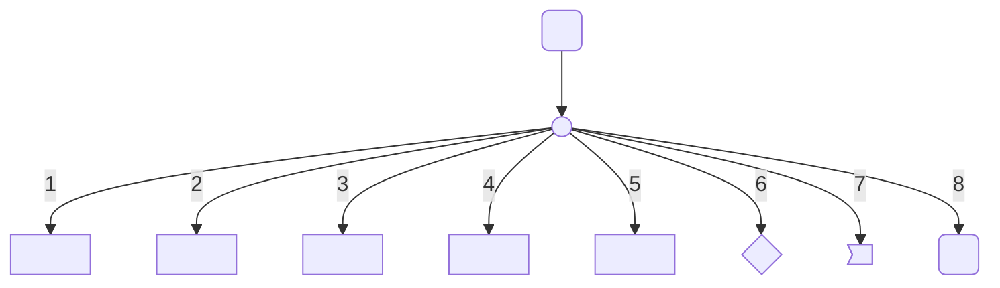
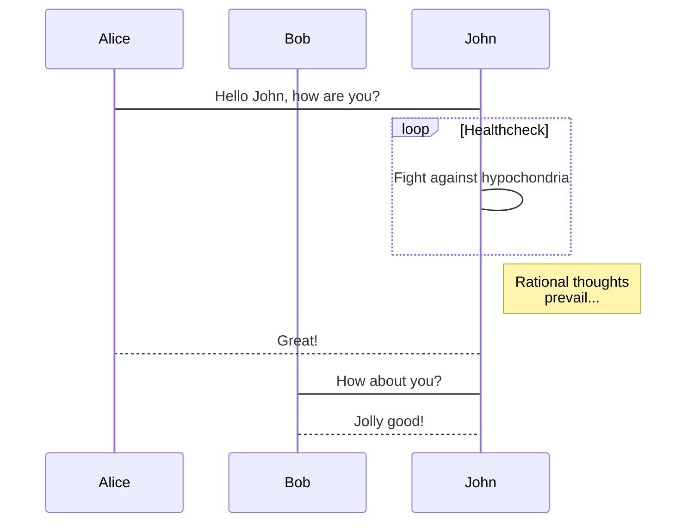
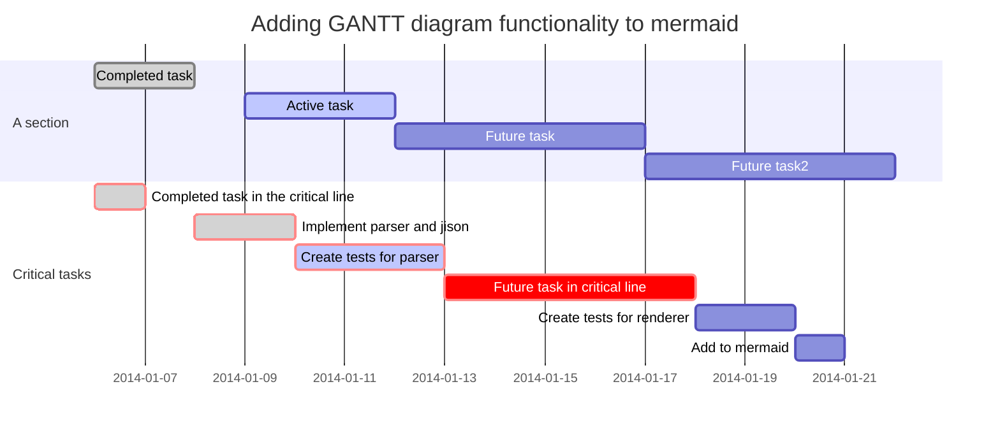
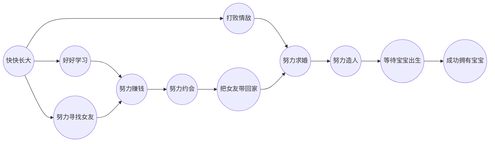

###  Atom Markdown Test
****
1.An example of a flowchart
---------------------------

2.An example of a sequence diagram
----------------------------------------

3.An example of a gantt diagram
------------------------------------

4.A normal way to Have a baby
---------------------------------

